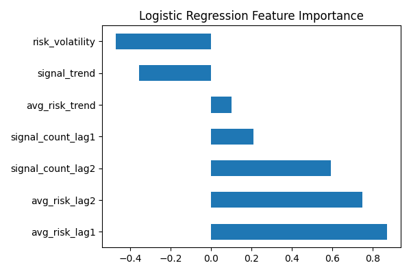
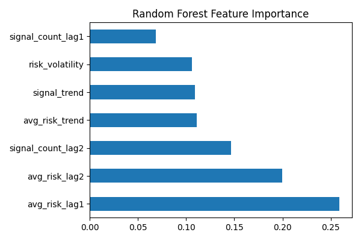
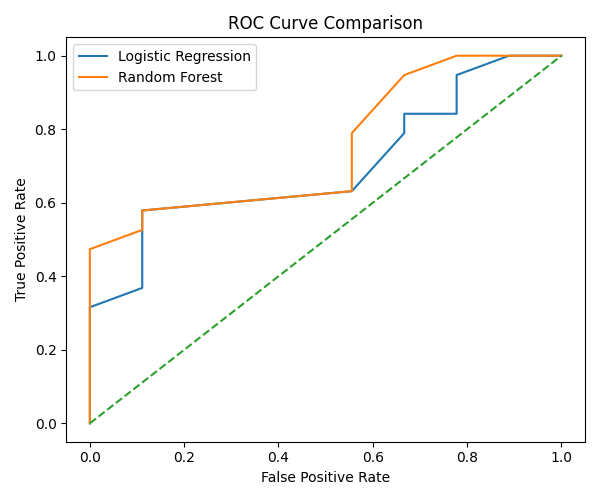

# Overview
Test project which implements a predictive AI prototype model trained using Logistic Regression and Random Forest that detects early warning signals of retrenchment and workplace grievance risks using publicly available data sources, including:
= Online news articles
- Global event databases (GDELT)
- Wikipedia corporate context
The system applies weak supervision, time-series feature engineering, and interpretable machine learning models to predict elevated labor risk periods before known real-world incidents.

Two real-world case studies are used:
- Meta (Facebook): mass layoffs and restructuring (2022-2023)
- Starbucks: Labor unionization and worker protests (2021-2025)

# Data Collection
- Scraped public news and corporate context
- Signal Filtering & Weak Labeling
- Rule-based risk labeling using domain keywords
- Temporal Aggregation (weekly aggregation of public risk signals)
- Model Traaining of Logistic Regression (primary) vs Random Forest (comparison)

# Results
### Logistic Regression Feature 

### Random Forest Feature

### ROC Curve Comparison

### Summary
- Logistic Regression provides better overall balance between false positives and false negatives.
- Random Forest achieves a higher ROC-AUC (Receiver Operating Characteristic-Area Under the Curve), indicating stronger ranking ability, but suffers from class imbalance sensitivity, reducing balanced accuracy.
- For early risk detection, Logistic Regression is more reliable due to higher balanced accuracy.
